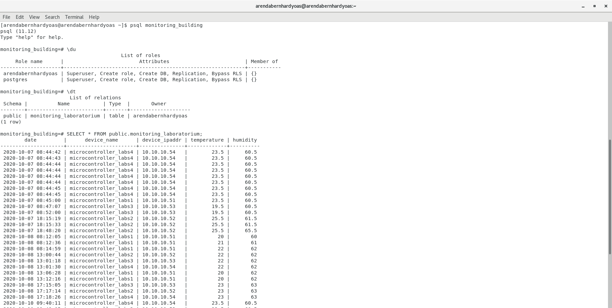
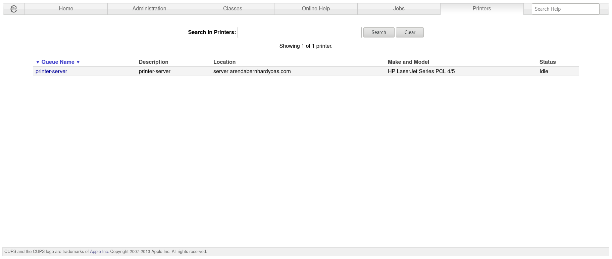
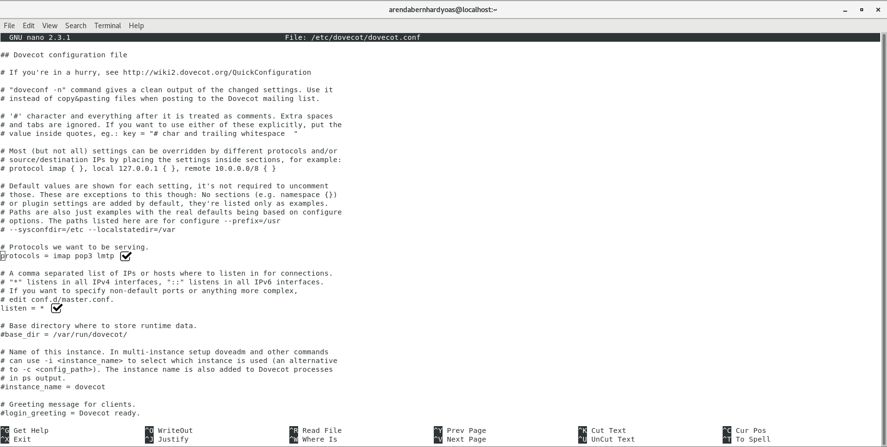
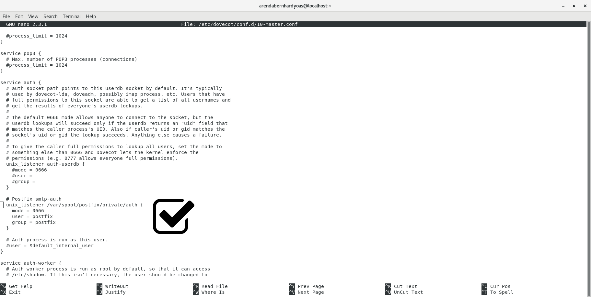
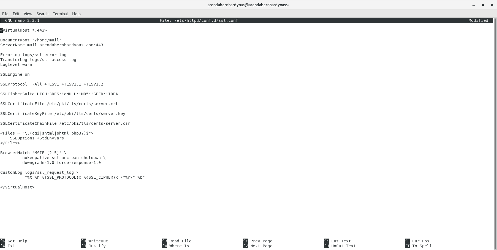

# CentOS 7: Server

## Build a server with Linux CentOS 7

### Initial Config
Resize storage 

`sudo rootfs-expand`

`sudo reboot` 
Set up ip address network interface 
`nmtui` 

Verify connection 
`ping 8.8.8.8 -c 4` 
`ping youtube.com -c 4` 

Update packages 
`sudo yum -y update` 
`sudo reboot` 
Install group package server with desktop environment 
`sudo yum groupinstall -y "Server with GUI"` 
`sudo reboot` 
GNOME desktop environment 

Disable firewall 
`sudo systemctl stop firewalld` 
`sudo systemctl disable firewalld` 
Disable SELinux 
`sudo nano /etc/selinux/config` 

`sudo reboot` 
Set up remote desktop vnc server 
`sudo yum install -y tigervnc-server` 
`vncserver :1` 

`vncserver -kill :1` 
Set up remote desktop xrdp server 
`sudo yum --enablerepo=epel install -y xrdp` 
`sudo systemctl start xrdp` 
`sudo systemctl enable xrdp` 
`sudo reboot` 
Add additional repositories 
`sudo yum install -y epel-release` 
`sudo yum install -y centos-release-scl-rh centos-release-scl` 

### DNS Server
Install BIND 
`sudo yum install -y bind bind-utils` 
Configure BIND 
`sudo nano /etc/named.conf` [file](./configs/named.conf) 

Configure name resolution (forward lookup) 
`sudo nano /var/named/forward.arendabernhardyoas.com` [file](./configs/forward.arendabernhardyoas.com) 

Configure address resolution (reverse lookup) 
`sudo nano /var/named/reverse.17.17.172` [file](./configs/reverse.17.17.172) 

`sudo systemctl start named` 
`sudo systemctl enable named` 
Change DNS server network device 
`nmtui`

`nmcli connection down Wired\ connection\ 1; nmcli connection up Wired\ connection\ 1` 
Additional configuration MikroTik router 

Verify configurations 

### Web Server NGINX
Create new repository from [here](https://nginx.org/en/linux_packages.html) 
`sudo nano /etc/yum.repos.d/nginx.repo` [file](./configs/nginx.repo) 

Install NGINX 
`sudo yum --enablerepo=nginx install -y nginx` 
Instal PHP and PHP-FPM 
`sudo yum --enablerepo=centos-sclo-rh install -y rh-php73-php rh-php73-php-mbstring rh-php73-php-pear rh-php73-php-fpm` 
Configurations 
`sudo scl enable rh-php73 bash` 
`sudo nano /etc/profile.d/rh-php73.sh` 

`sudo systemctl start nginx rh-php73-php-fpm` 
`sudo systemctl enable nginx rh-php73-php-fpm` 
`sudo nano /etc/opt/rh/rh-php73/php-fpm.d/www.conf` [file](./configs/www.conf) 

`sudo nano /etc/nginx/conf.d/default.conf` [file](./configs/default.conf) 

`sudo chmod 755 -R /home/arendabernhardyoas` 
`sudo systemctl restart nginx rh-php73-php-fpm` 
Verify configurations 

### Database PostgreSQL
Create new repository from [here](https://www.postgresql.org/download/linux/redhat/) 
`sudo yum install -y https://download.postgresql.org/pub/repos/yum/reporpms/EL-7-aarch64/pgdg-redhat-repo-latest.noarch.rpm` 
Install postgresql 
`sudo yum install -y postgresql11-server` 
Configure postgresql 
`sudo /usr/pgsql-11/bin/postgresql-11-setup initdb` 
`sudo systemctl start postgresql-11` 
`sudo systemctl enable postgresql-11` 
`sudo nano /var/lib/pgsql/11/data/postgresql.conf` [file](./configs/postgresql.conf) 

`nano /var/lib/pgsql/11/data/pg_hba.conf` [file](./configs/pg_hba.conf) 

Adding address `0.0.0.0/0` can create postgresql connections from anywhere. 
Create postgresql superuser with unix user 
`sudo su - postgres` 
`createuser -s -i -d -r -l -w arendabernhardyoas` 
`psql -c "alter role arendabernhardyoas with password '<<password>>'"` 
`psql -c "alter role arendabernhardyoas with replication"` 
`psql -c "alter role arendabernhardyoas with bypassrls"` 
`exit` 

Install PHP-PostgreSQL connector 
`sudo yum --enablerepo=centos-sclo-rh install -y rh-php73-php-pgsql` 
`sudo systemctl restart postgresql-11` 
Verify configurations 

### Database MariaDB
Create new repository from [here](http://downloads.mariadb.org/mariadb/repositories/) 
`sudo nano /etc/yum.repos.d/mariadb.repo` 

Install MariaDB 
`sudo yum --enablerepo=mariadb install -y MariaDB-server` 
Install PHP-MySQL connector 
`sudo yum --enablerepo=centos-sclo-rh install -y rh-php73-php-mysqlnd` 
`sudo systemctl start mariadb` 
`sudo systemctl enable mariadb` 
`sudo mariadb-secure-installation` 

`sudo systemctl restart mariadb` 
`sudo mariadb` 
`create user 'arendabernhardyoas'@'%' identified by '<<password>>';` 
`grant all privileges on *.* to 'aby'@'%' with grant option;` 
`flush privileges;` 
`\q` 

Verify Configurations 

### Samba
Install 
`yum -y install samba samba-client` 
Configure 
`nano /etc/samba/smb.conf` [file](./configs/smb.conf) 
`mkdir /home/public` 
`chmod 777 -R /home/public` 
`chown -R nobody:nobody /home/public` 
`systemctl start smb nmb` 
`systemctl enable smb nmb` 
Set password samba user with unix user 
`smbpasswd -a arendabernhardyoas` 
Verify configurations 

### CUPS
Install CUPS 
`sudo yum install -y cups` 
`sudo nano /etc/cups/cupsd.conf` [file](./configs/cupsd.conf) 
`sudo systemctl start cups` 
`sudo systemctl enable cups` 
Create printer 
`sudo lpadmin -p printer-server -E -m drv:///sample.drv/laserjet.ppd -L "server arendabernhardyoas.com" -o printer-is-shared=true -v serial:/dev/ttyprintk?baud=1200+bits=8+parity=none+flow=none` 
`sudo systemctl restart cups smb nmb` 
Verify Configurations 

### Mail Server
Install Postfix 
`sudo yum install -y postfix` 
Configure Postfix 
`sudo nano /etc/postfix/main.cf` [file](./configs/main.cf) 

`sudo systemctl start postfix` 
`sudo systemctl enable postfix` 
Postfix run SMTP server on tcp port 25 
Install Dovecot 
`sudo yum install -y dovecot` 
Configure Dovecot 
`sudo nano /etc/dovecot/dovecot.conf` [file](./configs/dovecot.conf) 

`sudo nano /etc/dovecot/conf.d/10-auth.conf` [file](./configs/10-auth.conf) 

`sudo nano /etc/dovecot/conf.d/10-mail.conf` [file](./configs/10-mail.conf) 

`sudo nano /etc/dovecot/conf.d/10-master.conf` [file](./configs/10-master.conf) 

`nano /etc/dovecot/conf.d/10-ssl.conf` [file](./configs/10-ssl.conf) 

`sudo systemctl start dovecot` 
`sudo systemctl enable dovecot` 
Dovecot run POP service on tcp port 110 and IMAP on tcp port 143 
Configure mail account 
`sudo yum install -y mailx` 
`sudo nano /etc/profile` 

`sudo systemctl restart postfix dovecot` 
Verify configurations 

### Web Server Apache
Install httpd (Apache) 
`yum -y install httpd` 
Configure httpd 
`nano /etc/httpd/conf/httpd.conf` [file](./configs/httpd.conf) 

`systemctl start httpd` 
`systemctl enable httpd` 
Install PHP 
`yum -y install php php-mbstring php-pear` 
Configure httpd user directory
`nano /etc/httpd/conf.d/userdir.conf` [file](./configs/userdir.conf) 

`chmod 755 -R /home/arendabernhardyoas` 
`mkdir /home/mail` 
`chmod 755 -R /home/mail` 
`chown -R arendabernhardyoas:arendabernhardyoas /home/mail` 
Configure httpd SSL/TLS 
`yum -y install mod_ssl` 
`nano /etc/httpd/conf.d/ssl.conf` [file](./configs/ssl.conf) 

Configure httpd virtual host 
`nano /etc/httpd/conf.d/vhost.conf` [file](./configs/vhost.conf) 

`systemctl restart httpd` 
Install SquirrelMail 
`yum --enablerepo=epel -y install squirrelmail` 
`curl -O http://www.squirrelmail.org/plugins/compatibility-2.0.16-1.0.tar.gz` 
`curl -O http://www.squirrelmail.org/plugins/empty_trash-2.0-1.2.2.tar.gz` 
`curl -O http://www.squirrelmail.org/plugins/secure_login-1.4-1.2.8.tar.gz` 
`tar zxvf compatibility-2.0.16-1.0.tar.gz -C /usr/share/squirrelmail/plugins` 
`tar zxvf empty_trash-2.0-1.2.2.tar.gz -C /usr/share/squirrelmail/plugins` 
`tar zxvf secure_login-1.4-1.2.8.tar.gz -C /usr/share/squirrelmail/plugins` 
`rm -f ./*.tar.gz`
Configure SquirrelMail 
`/usr/share/squirrelmail/config/conf.pl` 

`cp /usr/share/squirrelmail/plugins/secure_login/config.sample.php /usr/share/squirrelmail/plugins/secure_login/config.php` 
`nano /usr/share/squirrelmail/plugins/secure_login/config.php` 

`nano /home/mail/index.php` 

`systemctl restart httpd` 
Verify configurations 

### Other Config
Create SSL certificates self sign 
`cd /etc/pki/tls/certs` 
`make server.key` 
`openssl rsa -in server.key -out server.key` 
`make server.csr` 
`openssl x509 -in server.csr -out server.crt -req -signkey server.key -days 365` 

** **

**NOTE:** 
To get more CentOS 7 update packages using external repository and/or package download from official website is recommended 
Mirror download sources [here](http://isoredirect.centos.org/altarch/7/isos/aarch64/) CentOS Raspberry Pi inside folder `/images/` [example](https://mirror.papua.go.id/centos-altarch/7.9.2009/isos/aarch64/images). 
Raspberry Pi 4 ARM 64-bit 4GB RAM 
MikroTik RB941-2nD
